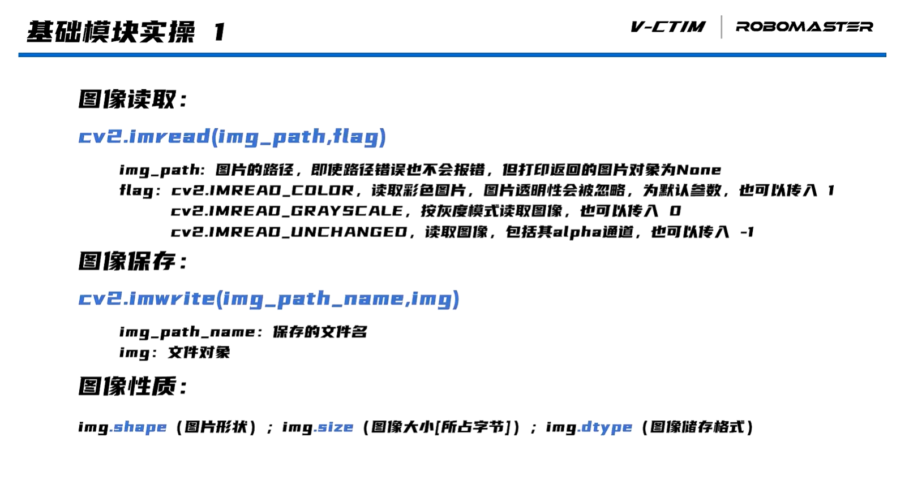
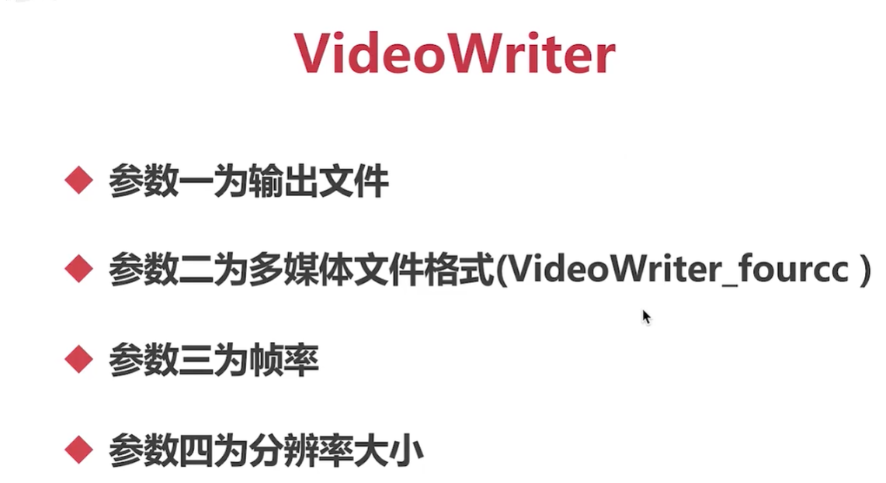
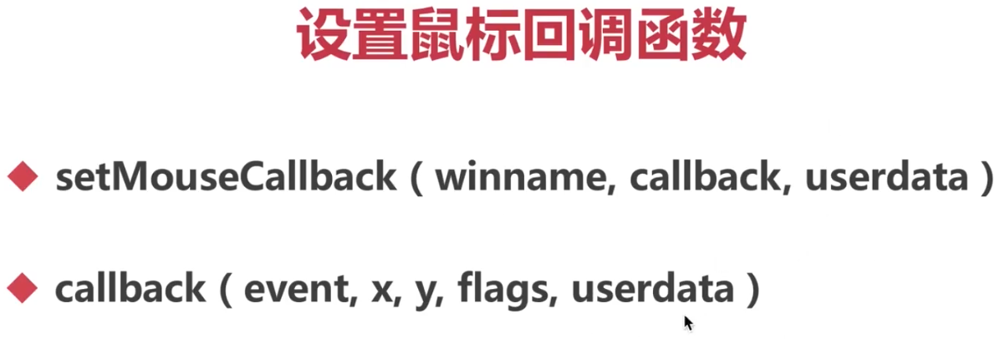
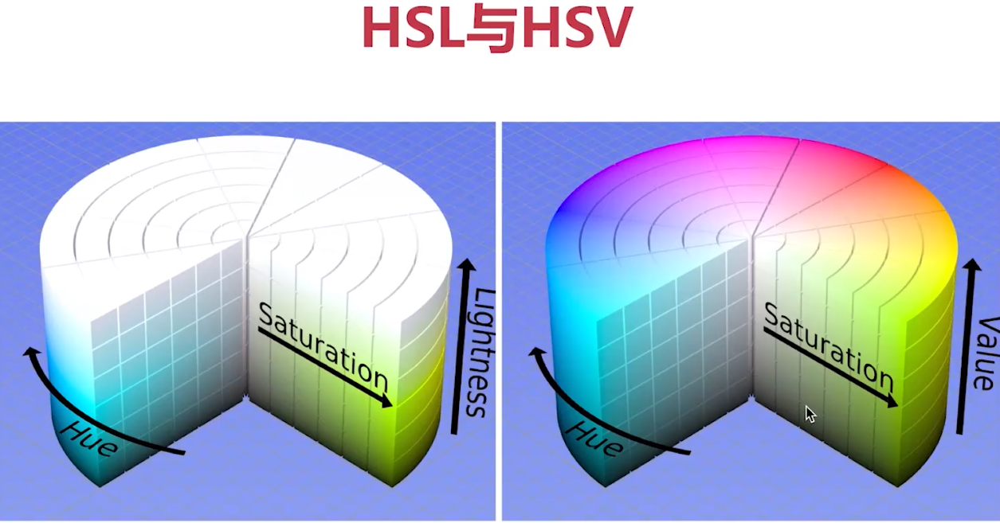

### 创建和显示窗口
- namedWindow()
    >WINDOW_NORMAL可以改变窗口大小
- imshow()
    >显示窗口
- destroyALLWindows()
    >销毁窗口
- resizeWindow
    >窗口大小设置

```python
import cv2
cv2.namedWindow('new', cv2.WINDOW_AUTOSIZE)
cv2.resizeWindow('new', 640, 480)
cv2.imshow('new', 0)
#0一直显示，窗口展示要调用waitKey
key = cv2.waitKey(0)
if(key == 'q'):
    exit()
cv2.destroyAllWindows()
```
### 图片
1.imread(r"C:\Users\Name")<br>
2.imread("C:\\Users\\Name")<br><br>
 

### 视频
| 采集             | 录制           |
|----------------|--------------|
| VideoCapture() | VideoWrite() |
| cap.read()     | write        |
| cap.release()  | release      |




**RGB(人和计算机)，BGR(openCV)**

